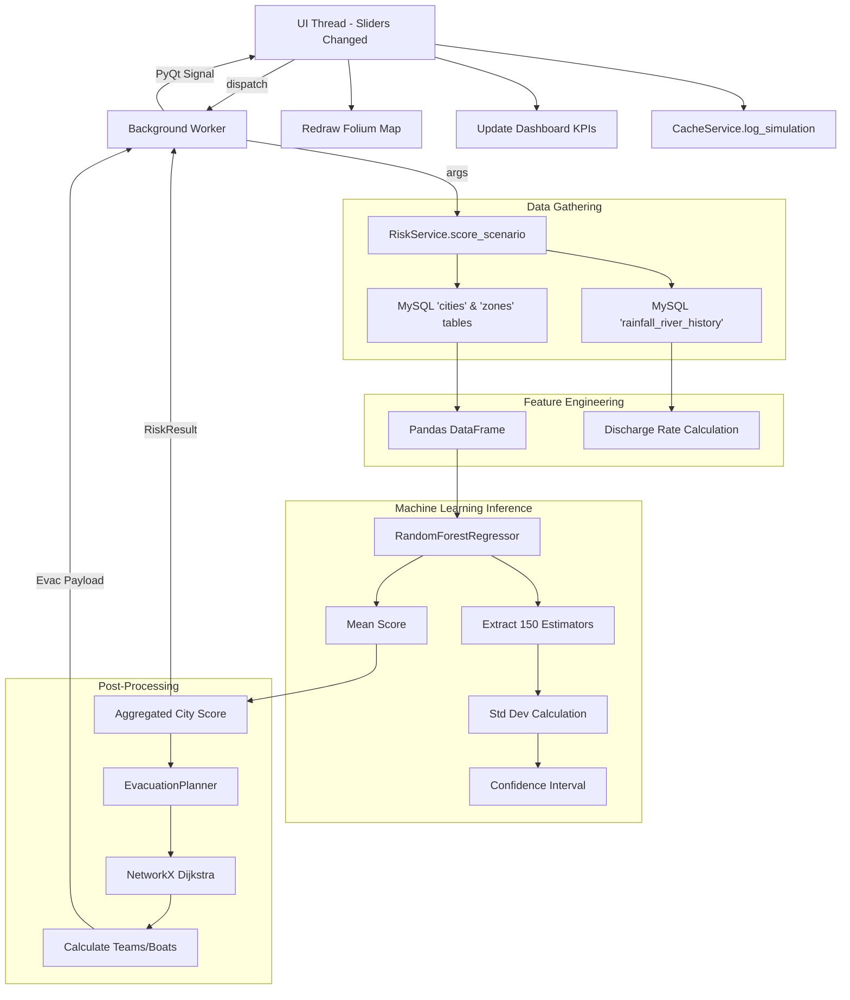

# FloodGuard Complete Backend Developer Reference

## 1. Backend Architecture Overview

### 1.1 Overall Backend Architecture
FloodGuard’s backend is designed as an embedded, highly cohesive monolithic service layer residing alongside the PyQt6 desktop frontend. The backend encapsulates data persistence, mathematical modeling, geographic routing, external API communication, and localized AI interactions. It follows a classic layered architecture where the UI communicates strictly with stateless service classes, which in turn communicate with underlying data repositories or external APIs.

### 1.2 Design Philosophy
The backend design is driven by two critical EOC (Emergency Operations Center) requirements: **Resilience** and **Graceful Degradation**. 
- **Resilience**: The backend must never crash the UI thread. All heavy I/O tasks are pushed to `QThread` workers.
- **Graceful Degradation**: The system prefers live data (MySQL, Open-Meteo API, OSRM) but seamlessly falls back to local cached JSON files, mathematical approximations, and synthetic historical data when networks fail.

### 1.3 Module Responsibilities
- **Data Access Layer**: `repository.py` and `cache_service.py` abstract the database/JSON layer.
- **Integration Layer**: `weather_service.py`, `city_service.py`, `routing_service.py` handle external HTTP APIs.
- **Domain Logic**: `risk_service.py` and `evacuation.py` hold the core mathematical and predictive business logic.
- **Intelligence**: `risk_model.py` (scikit-learn integration) and the AI context builders interact with predictive systems.

### 1.4 Data Flow and Control Flow
1. **Control Flow**: The UI (`app.py`) initiates a request via a background worker thread. The worker calls a static method on a service class (e.g., `CityService.search_and_fetch_city`). The service class executes synchronous, blocking logic and returns a result payload or raises an exception. The background worker catches the result/exception and emits a PyQt signal back to the UI thread.
2. **Data Flow**: Data primarily flows from external APIs into the MySQL `cities` and `rainfall_river_history` tables. From there, it is queried by the `RiskService`, transformed into NumPy arrays, and fed into the `FloodRiskModel`. The resulting risk scores are passed to the `EvacuationPlanner`, which queries `RoutingService` for road geometries.

### 1.5 Why This Architecture Was Chosen
- **Stateless Services**: Using static methods inside stateless service classes (e.g., `CacheService.get_stale_cities()`) prevents complex state synchronization bugs in a multi-threaded PyQt environment.
- **Embedded Database**: MySQL was chosen over SQLite to allow multi-operator access in an EOC environment, but the database connection is managed directly by the desktop app rather than a separate middle-tier REST server, eliminating latency and reducing deployment complexity.

---

## 2. Complete Backend Folder Structure

### `floodguard/`
- **Purpose**: The primary package housing all backend business logic and services.
- **Responsibility**: Abstracting away all complexities related to data storage, machine learning, and third-party APIs so the frontend UI only deals with high-level Python dictionaries and dataclasses.
- **Files Inside**: `__init__.py`, `config.py`, `db.py`, `repository.py`, `cache_service.py`, `city_service.py`, `weather.py`, `weather_service.py`, `risk_model.py`, `risk_service.py`, `evacuation.py`, `routing_service.py`, `map_assets.py`, `seed_definitions.py`.
- **Dependencies**: Depends on external libraries (`requests`, `mysql-connector-python`, `scikit-learn`, `networkx`, `joblib`, `numpy`, `pandas`).
- **Relationship with other folders**: 
  - Reads from `models/` (loads the `.joblib` model).
  - Reads/Writes to `assets/` (manages the `seed_cache.json` and placeholder map images).
  - Directly imported by the root `app.py`.

### `models/`
- **Purpose**: Storage for serialized machine learning artifacts.
- **Files Inside**: `flood_risk_model.joblib`.
- **Relationship**: Read exclusively by `risk_model.py`. Written to by the root-level `train_model.py` script.

### `assets/`
- **Purpose**: Storage for local persistent data fallback files and static assets.
- **Files Inside**: `seed_cache.json`, `maps/` directory containing PNG files.
- **Relationship**: `repository.py` reads/writes the JSON file. `map_assets.py` generates missing PNG files here.

---

## 3. Every Backend File (Part A)

### 3.1 `__init__.py`
- **Purpose**: Marks the `floodguard` directory as a Python package.
- **Why it exists**: Required by Python to allow absolute and relative imports across the application.
- **Internal workflow**: Empty file.

### 3.2 `config.py`
- **Purpose**: Centralizes path resolution and application-wide constants.
- **Why it exists**: To avoid hardcoding absolute paths or relative string paths, which break depending on the working directory from which the app is launched.
- **Imports**: `Path` from `pathlib`.
- **Constants**:
  - `ROOT`: `Path(__file__).parent.parent`
  - `ASSETS_DIR`: `ROOT / "assets"`
  - `MAPS_DIR`: `ASSETS_DIR / "maps"`
  - `MODELS_DIR`: `ROOT / "models"`
  - `MODEL_PATH`: `MODELS_DIR / "flood_risk_model.joblib"`
  - `CACHE_PATH`: `ASSETS_DIR / "seed_cache.json"`
  - `PALETTE`: Dictionary of standardized hex color codes.
- **Which files call it**: Imported widely across UI and backend (`map_assets.py`, `city_service.py`, `risk_model.py`).

### 3.3 `db.py`
- **Purpose**: Low-level database connection manager and query executor.
- **Why it exists**: To encapsulate `mysql.connector` boilerplate, handle environment variable parsing, and provide safe context managers for database connections.
- **Dependencies**: `mysql.connector`, `os`, `getpass`.
- **Functions**:
  - `db_config()`: Reads environment variables (`FLOODGUARD_DB_HOST`, `PORT`, `USER`, `PASSWORD`, `NAME`). Uses a 1-second `connection_timeout` to fail fast.
  - `mysql_connection()`: Context manager (`@contextlib.contextmanager`). Yields a connection, ensuring `.close()` is called in a `finally` block to prevent leaks.
  - `fetch_all(query, params)`: Executes a SELECT query, returning a list of dictionaries (`dictionary=True`).
  - `execute(query, params)`: Executes an INSERT/UPDATE/DELETE query and calls `commit()`.
- **Error Handling**: Database errors propagate upward for the service layer to handle.

### 3.4 `repository.py`
- **Purpose**: Implements the legacy dual-mode (MySQL/JSON) Repository Pattern.
- **Why it exists**: Provides a unified data access interface that transparently falls back to a local JSON file (`seed_cache.json`) if the MySQL server crashes or is unreachable.
- **Classes**: `FloodRepository`
  - **`_check_mysql()`**: Attempts a `SELECT 1` query. Sets the `using_mysql` boolean flag.
  - **Read Methods** (`cities`, `zones`, `shelters`, etc.): If `using_mysql` is True, queries `db.py`. If a `mysql.connector.Error` occurs, logs it, sets `using_mysql = False` (permanent degradation for the session lifecycle), and reads from the in-memory JSON cache dictionary.
  - **Write Methods** (`log_simulation`, `add_city`): Writes to JSON *first*, then attempts MySQL.
- **Side effects**: Modifies the `seed_cache.json` file on disk.

### 3.5 `cache_service.py`
- **Purpose**: The modern, MySQL-primary data service layer with self-healing schema capabilities.
- **Why it exists**: To handle transactional saves (with rollbacks), weather data updates, staleness tracking, and automatic schema initialization.
- **Classes**: `CacheService`
  - **`initialize_db_schema_if_needed()`**: Executes `SHOW TABLES`. If tables are missing, runs raw DDL `CREATE TABLE` statements for `cities`, `zones`, `shelters`, `infrastructure`, `rainfall_river_history`, and `simulation_logs`.
  - **`save_city(city_bundle)`**: Opens a transaction. Inserts into all tables sequentially using `executemany`. If any step fails, calls `conn.rollback()` before raising the error, preventing partial city inserts.
  - **`update_city(city_id, weather_data)`**: Updates weather columns and calculates `flood_occurred` heuristically.
  - **`get_stale_cities(hours=6.0)`**: Calculates time delta against the `last_updated` MySQL `TIMESTAMP` column.
- **Error Handling**: Uses transaction rollbacks. Raises exceptions to the caller.
- **Which files call it**: `app.py` for all DB interactions during refresh and search workflows.


## 3. Every Backend File (Part B)

### 3.6 `city_service.py`
- **Purpose**: Geocodes user text inputs into coordinates and generates deterministic synthetic data for newly discovered cities.
- **Why it exists**: The app allows searching for any city in the world. Nominatim provides coordinates, but FloodGuard needs zones, shelters, and history. This file fakes that data for cities not in the original seed.
- **Imports**: `requests`, `math`, `random`, `datetime`, `logging`, `config.py`.
- **Functions**:
  - `geocode_city(name)`: Uses Nominatim API. Extracts latitude, longitude, and state.
  - `fetch_elevation(lat, lon)`: Uses Open-Meteo elevation.
  - `generate_default_city_bundle(...)`: A massive algorithmic function. Generates 6 zones radially (using sine/cosine), 3 shelters with random capacities, 1 infrastructure (hospital), and 90 days of synthetic historical data featuring a seasonal sine wave overlaying a Gaussian baseline.
- **Side effects**: Makes HTTP requests. Uses `random`, so consecutive calls for the same coordinates will yield different synthetic history.

### 3.7 `weather.py`
- **Purpose**: A legacy/lightweight weather API interface.
- **Why it exists**: Used in simpler scripts or as a fallback. Replaced in production by `weather_service.py`.
- **Functions**:
  - `geocode_city(name)`: Uses Open-Meteo geocoding.
  - `fetch_open_meteo(lat, lon)`: Simple `requests.get` with no retry logic.

### 3.8 `weather_service.py`
- **Purpose**: Production-grade Open-Meteo API client with robust fault tolerance.
- **Why it exists**: The dashboard relies heavily on live weather. Weather APIs rate-limit and time-out frequently. This file guarantees delivery or graceful failure.
- **Classes**:
  - `WeatherService`: Contains `fetch_weather(lat, lon, timeout, progress_callback)`.
- **Internal workflow**:
  - Enters a loop (max 5 attempts).
  - Executes GET request.
  - If successful, parses JSON: `rainfall_mm = max(rain, precipitation)`.
  - If HTTP 429 (Rate Limit) or Timeout: Calculates sleep time (`2 ** attempt`), triggers `progress_callback(msg)`, sleeps, and continues.
  - If HTTP 4xx (Client Error, non-429): Raises `WeatherInvalidResponseError` immediately (no retry).
- **Error handling**: Defines 5 custom exceptions (`WeatherTimeoutError`, `WeatherConnectionError`, `WeatherRateLimitError`, `WeatherInvalidResponseError`, `WeatherServiceError`).

### 3.9 `risk_model.py`
- **Purpose**: The Machine Learning inference engine.
- **Why it exists**: Encapsulates the `joblib` model loading, NumPy array transformation, and confidence interval calculation.
- **Imports**: `joblib`, `numpy`, `pandas`, `sklearn.preprocessing.StandardScaler`, `sklearn.ensemble.RandomForestRegressor`.
- **Classes**:
  - `RiskResult` (Dataclass): Data Transfer Object holding `score`, `confidence`, `pattern`, `discharge_rate`.
  - `FloodRiskModel`:
    - `__init__()`: Loads `MODEL_PATH`.
    - `score_zone(...)`: Main inference method. Converts inputs to a DataFrame. Calls `model.predict()`. Accesses `model.named_steps["forest"].estimators_` to calculate variance across all 150 decision trees for confidence intervals.
    - `city_score(...)`: Averages zone scores into a city-level score.
- **Functions**:
  - `train_and_save_model(history_rows)`: The training pipeline. Synthesizes data, fits the pipeline, and dumps via `joblib`.
  - `_slope(values)`: Helper calculating linear regression slope via `np.polyfit(x, y, 1)[0]`.

### 3.10 `risk_service.py`
- **Purpose**: Bridge between the UI payload and the Machine Learning engine.
- **Why it exists**: Prepares the historical data arrays required by `risk_model.py`.
- **Classes**:
  - `RiskService`: Instantiates `FloodRiskModel` once. `score_scenario()` iterates over all zones, builds the recent history arrays, calls `model.score_zone()`, aggregates the result, and returns a combined dictionary.

### 3.11 `evacuation.py`
- **Purpose**: Graph-based mathematical evacuation planning.
- **Why it exists**: Determines which population goes to which shelter, factoring in distance, shelter capacity, and priority.
- **Imports**: `networkx`, `math`.
- **Classes**:
  - `EvacuationPlanner`:
    - `build_graph()`: Constructs an undirected `nx.Graph`. Connects each node to its 4 nearest geographic neighbors. Honors `blocked_edges`.
    - `plan()`: Core algorithm. Uses Dijkstra (`nx.shortest_path`) to map zones to shelters. Calculates required resources based on distance, population, and risk.

### 3.12 `routing_service.py`
- **Purpose**: OSRM API Client for real-world road geometries.
- **Why it exists**: NetworkX calculates logical graphs (straight lines). The map UI needs actual road poly-lines.
- **Classes**:
  - `RoutingService`: Uses `requests.Session()` and `@lru_cache`.
    - `get_nearest_road(lat, lon)`: Snaps to OSRM road graph.
    - `get_route(start, end)`: Fetches GeoJSON road polyline.
    - `find_best_shelter(...)`: Uses the high-performance OSRM `/table` endpoint for distance matrix generation.

### 3.13 `map_assets.py`
- **Purpose**: Generates dynamic placeholder maps.
- **Why it exists**: To prevent broken images in the UI if a city lacks a cached map. Uses `Pillow` (PIL) to draw lines and text.

### 3.14 `seed_definitions.py`
- **Purpose**: Stores the hardcoded baseline constants for the 10 core Indian cities.
- **Functions**: `build_seed_data()` uses `random.seed(42)` to algorithmically generate the exact same synthetic baseline data (zones, infrastructure, shelters, history) on every execution, guaranteeing identical startup states.

---

## 4. Every Important Function (Reference)

### `CacheService.save_city(city_bundle)`
- **Purpose**: Atomically saves a complete city hierarchy to MySQL.
- **Parameters**: `city_bundle` (dict containing city, zones, shelters, infrastructure, history data).
- **Return value**: None.
- **Step-by-step**:
  1. Opens connection and cursor.
  2. Parses `city_bundle['city']`. Executes INSERT into `cities`. Retrieves `LAST_INSERT_ID()`.
  3. Uses list comprehensions to build parameter tuples for zones, shelters, infra, and history, injecting the new `city_id` foreign key.
  4. Calls `cursor.executemany` for each child table sequentially.
  5. Calls `conn.commit()`.
- **Error handling**: Uses `try/except Exception as e`. In the `except` block, calls `conn.rollback()` before raising `e`.
- **Time complexity**: $O(N)$ where $N$ is total records (typically ~100 per city). I/O bound.

### `EvacuationPlanner.plan(zone_risks)`
- **Purpose**: Assigns zones to shelters and calculates resources.
- **Parameters**: `zone_risks` (dict mapping `zone_id` to risk score/pop).
- **Return value**: List of dictionary objects containing routing and resource data, sorted by priority.
- **Step-by-step**:
  1. Filters `self.shelters` for those where `capacity - current_occupancy > 0`.
  2. Iterates over `zone_risks`.
  3. For each zone, computes shortest paths to all available shelters using `nx.shortest_path_length`.
  4. Selects the nearest shelter. Extracts the exact path via `nx.shortest_path`.
  5. Computes `priority_score = (risk * population) / max(distance, 0.25)`.
  6. Calculates `teams = ceil(priority_score / 75000)`.
  7. Calculates `boats = ceil((risk - 55) / 18)`.
  8. Calculates `est_time = distance * 6.0 + (population / 3000) * 4.0`.
  9. Appends to results and sorts list descending by priority.
- **Algorithms involved**: Dijkstra's shortest path.
- **Error handling**: Catches `nx.NetworkXNoPath` and `nx.NodeNotFound` and skips that zone.

### `FloodRiskModel.score_zone(rainfall, river, zone, recent_rain, recent_river)`
- **Purpose**: Generates a risk prediction and calculates a confidence interval.
- **Parameters**: numerical inputs and recent historical arrays (list of floats).
- **Return value**: `RiskResult` dataclass.
- **Step-by-step**:
  1. Constructs a Pandas DataFrame with the 4 required features.
  2. Calls `self.model.predict(df)[0]`.
  3. Accesses `self.model.named_steps["forest"].estimators_`. Iterates over all 150 Decision Trees, calling `tree.predict(df_scaled)`.
  4. Calculates standard deviation of the 150 tree predictions using NumPy.
  5. `spread = max(std * 1.8, 5.0)`. Confidence is `[score - spread, score + spread]`.
  6. Calculates `discharge_rate = np.polyfit(range, recent_river, 1)[0]`.
  7. Evaluates pattern logic (Flash vs Riverine).
- **Time complexity**: $O(T \times D)$ where $T=150$ (trees) and $D$ is tree depth. Very fast (microseconds).


## 5. Complete Runtime Flow (Backend Perspective)

### 5.1 Application Startup
1. `app.py` UI initializes and invokes `start_initialization()` in a QThread.
2. The worker thread calls `CacheService.initialize_db_schema_if_needed()`.
3. `CacheService` executes `SHOW TABLES`. If missing, executes DDL and calls `build_seed_data()` to generate 10 seed cities, inserting them via `executemany`.
4. The worker thread then calls `CacheService.get_all_cached_cities()`.
5. The result is returned to the UI thread, which populates the dashboard sidebar.

### 5.2 Search City Flow
1. User enters "Jaipur". UI creates a QThread.
2. Thread calls `CacheService.city_exists("Jaipur")`. (Returns False).
3. Thread calls `CityService.search_and_fetch_city("Jaipur")`.
4. `CityService` calls `geocode_city("Jaipur")` (Nominatim API). Returns Lat/Lon.
5. `CityService` calls `fetch_elevation(lat, lon)` (Open-Meteo API).
6. `CityService` calls `WeatherService.fetch_weather(lat, lon)`.
7. `CityService` calls `generate_default_city_bundle(...)`, combining API data with algorithmic synthetic generation (zones, shelters, history).
8. Thread passes bundle to `CacheService.save_city(bundle)` for transactional MySQL insertion.
9. Thread calls `CacheService.load_city("Jaipur")` to retrieve the fully materialized object tree, which is returned to the UI.

### 5.3 Refresh Data Flow
1. UI triggers refresh QThread.
2. Thread calls `CacheService.get_stale_cities(hours=2.0)`.
3. For each stale city, thread calls `WeatherService.fetch_weather(lat, lon)`.
4. Thread calls `CacheService.update_city(city_id, weather_data)`, updating the `cities` table and appending a new row to `rainfall_river_history`.

---

## 6. Backend Services Summary

| Service | Purpose | Inputs | Outputs | Dependencies | Error Handling |
|---|---|---|---|---|---|
| **CacheService** | MySQL DAO | Dicts, IDs | Dicts, Lists | `db.py` | Transaction rollbacks. |
| **CityService** | Geocoding & Synthetic Data | Strings (City Names) | Dict (City Bundle) | `requests`, Nominatim | `requests.exceptions.HTTPError` |
| **WeatherService** | Open-Meteo client | Lat, Lon | Dict (Weather data) | `requests`, Open-Meteo | Exponential backoff, 5 custom exceptions. |
| **RoutingService** | OSRM client | Lat, Lon, Target Lists | GeoJSON, Coordinates | `requests`, OSRM | `@lru_cache`, broad `except Exception` fallback. |
| **RiskService** | ML Orchestrator | UI Sliders, Zone Data | `RiskResult` Objects | `risk_model.py` | Bubble up to UI thread. |

---

## 7. Machine Learning Backend

### 7.1 Overview
The ML backend uses a supervised regression approach to map environmental inputs to a deterministic risk score `[0, 100]`.

### 7.2 Dataset & Feature Engineering
- **Source**: `seed_definitions.py` generates 900 rows (90 days x 10 cities).
- **Synthetic Augmentation**: `train_model.py` creates 2 additional noisy rows for every real row using Gaussian jitter, resulting in 2700 rows.
- **Features**: `rainfall_mm`, `river_level_m`, `elevation_m`, `historical_flood_frequency`.
- **Target Label (Risk)**: Generated algebraically during training:
  `Risk = (Rain * 0.45) + (River * 11.5) + ((60 - Elev) * 0.35) + (Freq * 28) + (18 if Flood)`

### 7.3 Training Pipeline
1. `StandardScaler`: Normalizes the 4 features to $\mu=0, \sigma=1$. This aids in extracting feature importances and stabilizing variance calculations.
2. `RandomForestRegressor`: Selected because tree-based ensembles are highly effective on tabular data without requiring GPU acceleration. 
   - `n_estimators=150`: 150 parallel decision trees.
   - `min_samples_leaf=3`: Regularization to prevent deep, overfitted trees on noisy synthetic data.

### 7.4 Prediction & Confidence Calculation
During inference (`score_zone`):
1. The input vector is scaled.
2. The forest predicts the mean score across all 150 trees.
3. The backend extracts `estimators_` and runs prediction on *each* of the 150 trees individually.
4. It calculates the standard deviation ($\sigma$) of these 150 predictions.
5. The `confidence_spread` is calculated as $\max(\sigma \times 1.8, 5.0)$. This translates mathematically to roughly a 90% confidence interval, with a hard floor of 5.0 to ensure the UI doesn't imply absolute certainty.

---

## 8. Database Backend Deep Dive

FloodGuard operates a local MySQL 8 database.

### 8.1 Schema & Relationships
- **`cities` (1)** <---> **(N) `zones`**, **(N) `shelters`**, **(N) `rainfall_river_history`**, **(N) `simulation_logs`**
- **`zones` (1)** <---> **(N) `infrastructure`**

### 8.2 Read / Write Flow
- **Read Flow**: Executed via `db.fetch_all()`. Converts MySQL tuples into a Python list of dictionaries using `dictionary=True` cursor.
- **Write Flow**: Wrapped in `CacheService` methods. Uses `cursor.executemany` for batch inserts.
- **Synchronization**: `log_simulation()` handles the dual-layer logic. It inserts the log into MySQL, but *also* appends it to the in-memory Python dictionary and re-serializes `seed_cache.json` to disk, ensuring the JSON fallback is never completely stale.

### 8.3 Repository Pattern (Legacy Fallback)
`FloodRepository` encapsulates the logic to "Try MySQL; if crash, use JSON."
```python
def cities(self):
    if self.using_mysql:
        try:
            return fetch_all("SELECT * FROM cities")
        except Error:
            self.using_mysql = False # Permanent degradation
            # Fall through to cache
    return list(self.cache.get('cities', []))
```
This guarantees that an EOC dashboard remains operational even if the MySQL service stops unexpectedly.


## 9. Weather API Backend Deep Dive

FloodGuard relies on Open-Meteo for live atmospheric context.

### 9.1 Request Lifecycle (`WeatherService.fetch_weather`)
1. **Validation & Setup**: Takes `lat`, `lon`. Sets `timeout`, defaults `attempt = 1`.
2. **HTTP GET**: Queries `api.open-meteo.com/v1/forecast` requesting `temperature_2m,relative_humidity_2m,wind_speed_10m,rain,precipitation` (current) and `rain_sum` (daily).
3. **Parsing**: 
   - `current_weather = data["current"]`
   - `rainfall_mm = max(current_weather["rain"], current_weather["precipitation"])`. This ensures the worst-case precipitation metric is utilized for flood forecasting.
4. **Retry Mechanism**:
   - If a `requests.exceptions.Timeout` occurs, or `response.status_code == 429` (Too Many Requests).
   - Calls `time.sleep(2 ** attempt)`. Attempt 1 = 2s, Attempt 2 = 4s, Attempt 3 = 8s, Attempt 4 = 16s. Max 5 attempts.
   - Emits a progress callback string to the UI thread (e.g., `"Retrying weather (attempt 2)..."`).
5. **Error Recovery**:
   - If a 4xx error (other than 429) occurs, raises `WeatherInvalidResponseError` and breaks the retry loop immediately, as retrying a 404/400 is useless.

---

## 10. Routing Backend Deep Dive

### 10.1 NetworkX (Logical Routing)
The `EvacuationPlanner` models the city as an undirected graph $G(V, E)$.
- **Nodes ($V$)**: Every zone and every shelter.
- **Edges ($E$)**: A node connects to its 4 nearest neighbors based on the Haversine distance.
- **Dijkstra's Algorithm**: `nx.shortest_path_length(G, source, weight="weight")` explores the graph to find the minimum physical distance to all reachable shelters.

### 10.2 OSRM (Physical Routing)
While NetworkX handles logical assignments (Zone A goes to Shelter B), OSRM handles physical visualization (which actual streets to drive on).
- **Shelter Selection (`find_best_shelter`)**: 
  - Uses the OSRM `/table/v1/driving` endpoint.
  - Passes a string of coordinates: `{start_lon},{start_lat};{shelter1_lon},{shelter1_lat};{shelter2_lon},{shelter2_lat}...`
  - Parses the `distances` JSON array to find the minimum drivable distance in constant time $O(1)$ HTTP request.
- **Route Generation (`get_route`)**:
  - Uses `/route/v1/driving` with `geometries=geojson`.
  - Returns a pure GeoJSON LineString representing the physical road curves, which Folium then draws directly onto the map.

---

## 11. AI Advisor Backend Deep Dive

The AI Advisor uses a local installation of Ollama running `qwen2.5:3b`.

### 11.1 Model Loading & Keep-Alive
- `check_ollama()` probes `http://localhost:11434/api/tags`.
- It executes a dummy `/api/generate` request with the payload `{"model": "qwen2.5:3b", "keep_alive": -1}`.
- Setting `keep_alive: -1` is a critical backend decision. By default, Ollama unloads models from VRAM after 5 minutes of inactivity. During an emergency, a 10-second model loading delay is unacceptable. This parameter pins the model into memory indefinitely.

### 11.2 Context Generation (`_build_system_prompt`)
The AI backend does not have persistent memory or RAG (Retrieval-Augmented Generation). Instead, it relies on heavy dynamic context injection.
- Before every `/api/chat` request, the backend formats a massive markdown string containing:
  - Global city parameters.
  - State of the 5 What-If sliders.
  - Risk Model predictions (scores, patterns, discharge rates).
  - Zone demographics and shelter assignments.
- This creates "Zero-Shot Grounding," forcing the LLM to analyze the *current state* rather than hallucinating based on its training data.

### 11.3 Request Lifecycle
1. User enters text. UI thread dispatches to `ask_ai()` QThread.
2. Formats messages: `[{"role": "system", "content": <context>}] + self.ai_messages + [{"role": "user", "content": input}]`.
3. POST to `/api/chat`. `stream=False`. `timeout=45`.
4. Parses JSON `response["message"]["content"]`.
5. Appends to `self.ai_messages`.
6. Sends string back to UI thread for HTML formatting.

---

## 12. Backend Data Flow Diagrams

### Complete Dashboard Execution Pipeline


---

## 13. Module Relationships (Call Graph)

```mermaid
graph TD
    app[app.py (UI)] --> cache[cache_service.py]
    app --> city[city_service.py]
    app --> risk[risk_service.py]
    app --> route[routing_service.py]
    
    cache --> db[db.py]
    
    city --> nominatim[(Nominatim API)]
    city --> weather[weather_service.py]
    
    weather --> openmeteo[(Open-Meteo API)]
    
    risk --> model[risk_model.py]
    model --> joblib[(joblib file)]
    
    app --> evac[evacuation.py]
    evac --> netx[(NetworkX)]
    
    route --> osrm[(OSRM API)]
```


## 14. Algorithms

### 14.1 Random Forest (Ensemble Learning)
- **Concept**: A supervised regression algorithm that constructs a multitude of decision trees at training time and outputs the mean prediction of the individual trees.
- **Math**: Let $B$ be the number of trees ($150$). Let $f_b(x)$ be the prediction of the $b$-th tree. The forest prediction $\hat{y} = \frac{1}{B} \sum_{b=1}^{B} f_b(x)$.
- **Practical Application**: Prevents overfitting to the noisy synthetic dataset by ensuring no single decision tree memorizes the data outliers.

### 14.2 Confidence Calculation (Variance Extraction)
- **Concept**: Neural networks require complex Bayesian approaches for uncertainty. Random Forests provide it natively via tree variance.
- **Math**: Variance $\sigma^2 = \frac{1}{B-1} \sum_{b=1}^{B} (f_b(x) - \hat{y})^2$. Confidence Interval = $[\hat{y} - 1.8\sigma, \hat{y} + 1.8\sigma]$.
- **Practical Application**: If a zone has highly unusual inputs, some trees will predict 20, others 90. The mean might be 55, but the high $\sigma$ warns EOC operators that the model is uncertain.

### 14.3 Dijkstra’s Algorithm
- **Concept**: Finds the shortest paths between nodes in a graph.
- **Math**: Maintains a set of unvisited nodes. Assigns a tentative distance (infinity) to all nodes, 0 for the start node. Selects the unvisited node with the smallest distance, calculates the distance to its neighbors, and updates their tentative distances if smaller. Time complexity $O(|E| + |V| \log |V|)$ with a priority queue.
- **Practical Application**: Used by `NetworkX` in `evacuation.py` to map zones to shelters. 

### 14.4 Exponential Backoff
- **Concept**: A network retry strategy that multiplicatively decreases the rate of requests.
- **Math**: $E[c] = \text{wait} \times 2^c$ where $c$ is the collision/failure count.
- **Practical Application**: In `weather_service.py`, if Open-Meteo returns HTTP 429, the app sleeps for 1s, 2s, 4s, 8s, 16s before giving up, maximizing the chance of recovery without getting permanently IP-banned.

---

## 15. Error Handling & Recovery Strategy

The backend explicitly anticipates environmental failures.

### 15.1 API Failures
- **Timeout/Rate Limit**: Handled via exponential backoff (Weather) or LRU Cache serving stale data (Routing).
- **Hard Error (404/500)**: Raised immediately. The background worker catches it, emits `failed(str)`, and the UI displays an error label without freezing.

### 15.2 Database Failures
- **MySQL Missing/Crashed**: `_check_mysql()` fails. `FloodRepository` flips `using_mysql = False` and seamlessly shifts all `SELECT` operations to the in-memory Python dictionary loaded from `seed_cache.json`.
- **Constraint Violations**: Duplicate keys during `save_city` raise `mysql.connector.Error`. Caught by the `try/except`, which issues `conn.rollback()` to prevent partial state corruption, then propagates the error.

### 15.3 AI Model Failures
- If `ollama serve` is not running, `subprocess.Popen` attempts to start it.
- If the model `qwen2.5:3b` is not found, `ask_ai` traps the 404, parsing it into a user-friendly instruction to run `/api/pull`.

---

## 16. Performance

### 16.1 Why the Backend Remains Responsive
FloodGuard relies on PyQt6, which has a notorious "Global Interpreter Lock (GIL) + Event Loop" restriction. If a backend function blocks for 2 seconds (e.g., waiting for MySQL), the entire UI freezes.
- **QThreads & Workers**: The backend completely mitigates this. `run_background()` ensures *zero* I/O operations occur on the main thread.
- **Asynchronous Feel via Signals**: The backend returns data via PyQt Signals (`finished.emit(payload)`). The UI connects to these signals, achieving asynchronous behavior in a synchronous backend architecture.

### 16.2 Caching Strategies
- **Memoization**: `RoutingService` uses `@lru_cache(maxsize=1024)`. If an operator clicks Zone 4 repeatedly, the first click takes 400ms (OSRM HTTP request). Subsequent clicks take <1ms (Python memory retrieval).
- **Disk Caching**: `CacheService` writes to `seed_cache.json`.
- **VRAM Caching**: Ollama receives `keep_alive: -1` to hold the ~2GB LLM in GPU memory permanently.

---

## 17. Design Decisions

### 17.1 Why Python?
Rapid iteration, unmatched ML ecosystem (scikit-learn, Pandas), and native PyQt bindings. While C++ would be faster, UI development would take 5x longer, and ML integration would be incredibly difficult.

### 17.2 Why Random Forest over Neural Networks?
Tabular numerical data (rainfall, elevation) does not benefit significantly from Deep Learning. Random Forests require no GPU, train in milliseconds, don't suffer from vanishing gradients, and critically, provide interpretable decision paths and built-in variance calculations for confidence intervals.

### 17.3 Why Joblib over Pickle?
The trained Random Forest pipeline contains massive nested NumPy arrays representing the tree nodes. `joblib` is optimized specifically to serialize large NumPy arrays, achieving faster read times and smaller disk footprints than standard `pickle`.

### 17.4 Why NetworkX instead of direct OSRM for everything?
OSRM provides exact road geometries, but it operates as a black-box HTTP API. NetworkX allows the backend to manipulate the underlying mathematical graph (e.g., executing `block_edge()` to simulate a flooded highway) in sub-millisecond time offline, which is impossible with a public OSRM server.

---

## 18. Backend Glossary

- **Repository Pattern**: A design pattern that abstracts data access. The UI doesn't know if data comes from MySQL or JSON; it just asks the Repository.
- **Feature Engineering**: The process of using domain knowledge to extract features (characteristics, properties, attributes) from raw data.
- **Inference**: The stage in ML where a trained model makes predictions on new, unseen data (`model.predict`).
- **Serialization**: Converting a data structure (like a Python object or ML model) into a format that can be stored (like `.joblib` or `.json`) and reconstructed later.
- **Joblib**: A set of tools in Python providing lightweight pipelining, optimized for fast disk I/O on large NumPy arrays.
- **Node/Edge/Graph**: A Node is a point (Zone/Shelter). An Edge is the connection between them (Distance). The Graph is the total network.
- **GIS (Geographic Information System)**: Systems designed to capture, store, manipulate, analyze, manage, and present spatial or geographic data.

---

## 19. Developer Notes

### 19.1 Important Assumptions
- The database is running locally (localhost) on standard port 3306.
- The machine has at least 4GB of RAM (to support the ~2GB Ollama model + PyQt overhead).
- The operator will not run massive batch requests, avoiding OSRM API blacklisting.

### 19.2 Known Limitations
- The dual-mode database logic (`repository.py` vs `cache_service.py`) is technical debt resulting from rapid prototyping. They occasionally desync.
- The `generate_default_city_bundle` relies heavily on `random.gauss`, meaning history is entirely synthetic.

### 19.3 Future Backend Enhancements
- **SQLAlchemy ORM**: Replace raw string SQL queries in `cache_service.py` with SQLAlchemy models. This will standardize data access, eliminate SQL injection vectors permanently, and ease migration to PostgreSQL if required.
- **Pytest Suite**: The backend currently has zero unit tests. `test_app.py` is a manual script. A full pytest suite mocking `requests` (for OSRM/Weather) is needed.
- **Real IMD API Integration**: Replace the synthetic algorithmic data generation with actual CWC (Central Water Commission) historical data APIs.


