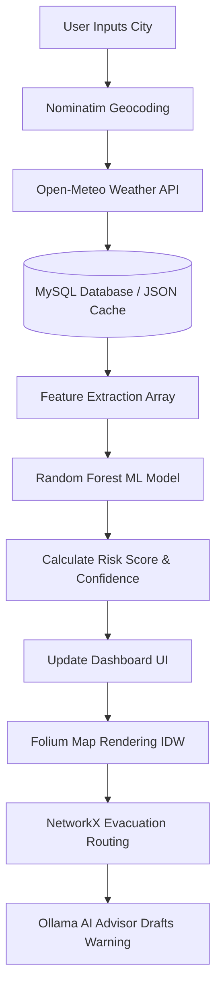

# FloodGuard – Ultimate Quick Revision Book

## 1. Project in 30 Seconds
**FloodGuard** is an offline-capable, AI-powered desktop dashboard built for Emergency Operations Centers (EOCs). It aggregates live weather data, uses a Random Forest Machine Learning model to predict flood risks in real-time, and automatically calculates the shortest evacuation routes and resource requirements (boats/teams) to save lives during a crisis.

## 2. Project in 1 Minute
When disaster strikes, EOC operators lose precious time checking separate weather, water, and map systems. **FloodGuard** unifies this. It is a Python (PyQt6) desktop app that fetches live Open-Meteo weather data and stores it in a dual-layer MySQL/JSON database. A 150-tree Random Forest model evaluates the weather alongside historical data and geographic elevation to calculate a precise Risk Score with a confidence interval. The UI instantly updates a GIS map (using Folium/Leaflet) with flood contours. Simultaneously, Dijkstra's algorithm maps the shortest drivable paths (via OSRM) to the nearest safe shelters, automatically calculating how many rescue boats and teams to deploy based on a priority algorithm.

## 3. Project in 3 Minutes
Currently, disaster response in India is entirely reactive. **FloodGuard** shifts this to predictive intelligence. 
- **The Core Problem**: Cloud-based apps fail during cyclones when internet lines snap. Therefore, FloodGuard is a monolithic desktop app designed for offline resilience.
- **The Intelligence**: Instead of neural networks that require massive GPUs, it uses a Scikit-Learn **Random Forest**. This handles tabular numerical data perfectly and provides crucial "Confidence Intervals" by measuring the variance between its 150 internal decision trees.
- **The Logistics**: Maps are useless without action. FloodGuard's Evacuation Planner uses **NetworkX (Dijkstra's Algorithm)** to calculate logical distances to shelters, checking capacity constraints. It uses the **Haversine formula** for spherical earth distances, and the **OSRM API** to draw actual road geometries on the map.
- **The AI**: During a flood, commanders don't have time to write public warnings. A local, private Large Language Model (**Ollama running qwen2.5:3b**) is injected with the exact live data (Zero-Shot Grounding) to draft accurate, hallucination-free emergency broadcasts instantly.

## 4. Complete Workflow

## 5. Technology Stack

| Technology | Purpose | Why Chosen |
|---|---|---|
| **Python 3.12** | Core Backend | Unmatched data science/ML ecosystem; fast prototyping. |
| **PyQt6** | Desktop UI | Native desktop performance, robust QThread background workers, QWebEngineView for embedding HTML maps. |
| **Scikit-Learn** | ML Framework | Industry standard for traditional ML; easy pipelines. |
| **Random Forest** | ML Algorithm | Handles tabular data perfectly; provides confidence variance; doesn't require GPU. |
| **MySQL 8** | Primary Database | Handles EOC concurrency safely; strict schemas. |
| **Joblib** | Model Storage | Optimized for serializing massive NumPy arrays faster than pickle. |
| **Open-Meteo** | Weather API | Completely free, open-source, no API keys, extensive hydrological data. |
| **OSRM** | Routing API | Free open-source engine returning actual road GeoJSON paths and distance matrices. |
| **Folium / Leaflet** | GIS Mapping | Bridges Python data arrays to interactive web-based map visualizations without writing JS. |
| **NetworkX** | Graph Math | Highly optimized C-based implementation of Dijkstra's algorithm. |
| **Ollama** | Local AI | Runs `qwen2.5` entirely offline, ensuring absolute data privacy and disaster availability. |

## 6. Backend Summary

| File | Purpose |
|---|---|
| `app.py` | The main UI orchestrator. 4900 lines. Handles Qt logic, sliders, and map HTML insertion. |
| `cache_service.py` | Transactional MySQL manager. Saves cities, tracks staleness, heals missing schemas. |
| `repository.py` | Legacy fallback manager. Swaps to `seed_cache.json` if MySQL crashes. |
| `city_service.py` | Geocodes city text. Generates synthetic 90-day history for new cities. |
| `weather_service.py` | Fetches live weather. Implements Exponential Backoff retries. |
| `risk_model.py` | Loads Joblib. Converts inputs to arrays. Evaluates 150 trees. Calculates variance. |
| `risk_service.py` | Prepares history arrays for the risk model. Aggregates zone scores to city scores. |
| `evacuation.py` | Graph math. Calculates Haversine distances. Runs Dijkstra to assign zones to shelters. |
| `routing_service.py` | OSRM API client. Snaps to real roads. Fetches GeoJSON polylines. |

## 7. Machine Learning Summary

- **Random Forest**: An ensemble method using 150 separate decision trees. Prevents overfitting.
- **Decision Tree**: A flowchart of IF/THEN rules. Prone to error on its own.
- **Training**: 2,700 rows of synthetic tabular data passed through a StandardScaler to normalize variances.
- **Prediction**: All 150 trees "vote" on a Risk Score (0-100). The mean is the final output.
- **Confidence**: The Standard Deviation (variance) between the 150 trees. High variance = Low Confidence.
- **Features (Inputs)**: Rainfall (mm), River Level (m), Elevation (m), Flood Frequency.
- **Labels (Outputs)**: A numerical Risk percentage (0-100).
- **Joblib**: The `.joblib` file is the saved "brain" of the model loaded into RAM on startup.

## 8. APIs Summary

| API | Purpose | Input | Output |
|---|---|---|---|
| **Open-Meteo** | Live weather telemetry | Latitude, Longitude | JSON: Rain, Temp, Wind |
| **Nominatim** | Geocoding city names | Text ("Surat") | JSON: Lat, Lon, State |
| **OSRM** | Road geometry & distance | GPS start/end points | GeoJSON LineStrings |
| **Ollama** | Local AI Text Generation | Massive Markdown Context | AI Text string |

## 9. Database Summary

- **Tables**: `cities`, `zones`, `shelters`, `infrastructure`, `rainfall_river_history`, `simulation_logs`.
- **Relationships**: Foreign Keys link everything to `cities.city_id`. `infrastructure` also links to `zones.zone_id`.
- **Offline Cache**: A strict dual-layer system. If a `mysql.connector.Error` occurs, the `repository.py` class flips a flag and begins reading the entire application state from the local `seed_cache.json` file.
- **Read Flow**: Returns lists of dictionaries via cursor `dictionary=True`.
- **Write Flow**: Wrapped in Transactions. If a city insert fails halfway, `conn.rollback()` prevents database corruption.

## 10. Maps Summary

- **Layers**: 5 toggleable layers: Population Density, Flood Risk, Elevation, Infrastructure (Pins), Evacuation Points.
- **Heatmaps (Contours)**: Raw data isn't colored block-by-block. The Python backend uses SciPy's `gaussian_filter` to blur a 40x40 grid, then Matplotlib extracts SVG contours, which Folium turns into HTML polygons.
- **Shelters & Roads**: Shelters are Folium markers. Roads are Folium `PolyLines` mapped using OSRM GeoJSON coordinate arrays.
- **Routing**: Click a zone -> App calls OSRM `/nearest` -> App calls OSRM `/table` to find distance to all shelters -> Draws route to the closest available shelter.

## 11. Evacuation Summary

- **Resource Allocation**: Not a guessing game. It is mathematically derived from the Priority Score.
- **Shelter Selection**: Filters out full shelters (`capacity - occupancy <= 0`), then uses Dijkstra to find the nearest remaining one.
- **Priority**: A metric determining the urgency of a zone. Driven by population density and immediate risk score.
- **Algorithms**: Haversine (sphere distance) + Dijkstra (graph traversal).

## 12. AI Advisor Summary

- **How it works**: Uses an invisible "Zero-Shot Grounding" System Prompt. It injects the entire numerical state of the dashboard (e.g., "Risk is 90, rain is 200mm") into the LLM before asking it to answer the user.
- **Why Local**: Because EOCs lose internet and handle classified data. Cloud AI (ChatGPT) is unacceptable for disaster resilience.
- **Limitations**: The `qwen2.5:3b` model is small (3 billion parameters) to run fast on local CPU/GPUs. It isn't a super-genius, but it is highly effective at summarizing the injected data.

## 13. Algorithms Cheat Sheet

- **Random Forest**: An ensemble ML algorithm. Instead of one decision tree, it builds 150. It prevents overfitting and gives a highly stable mean average.
- **Decision Tree**: A flowchart that splits data based on mathematical IF/THEN boundaries (e.g., IF rainfall > 50 AND elevation < 10).
- **Dijkstra's Algorithm**: Finds the absolute shortest path through a network of roads/zones by constantly exploring the closest unvisited paths first.
- **NetworkX**: A highly optimized Python library used to build the graph and run Dijkstra instantly.
- **Haversine Formula**: Calculates the exact distance between two GPS coordinates accounting for the curvature of the Earth.
- **Caching (`@lru_cache`)**: A memory trick. If the system asks for the route from Zone A to Shelter B twice, it remembers the first answer and doesn't ask the API again.
- **Retry Logic (Exponential Backoff)**: If a server fails, wait 1s. Fail again? Wait 2s. Fail again? Wait 4s. This stops us from being blocked by the server for spamming.

## 14. Formulas (Crucial to Remember)

### Risk Score Calculation (Training Target)
`Risk = (Rain * 0.45) + (River * 11.5) + ((60 - Elev) * 0.35) + (Freq * 28) + (18 if Flood)`
- **Explain**: This creates the label for the ML model. High river levels heavily penalize the score. High elevation mitigates it.

### Evacuation Priority Score
`Priority = (Risk * Population) / max(Distance, 0.25)`
- **Explain**: High risk + high population = high priority. Divided by distance, meaning closer shelters get slightly higher priority to clear immediate areas fast.

### Resource Allocation (Rescue Teams)
`Teams = ceil(Priority / 75000)`
- **Explain**: Allocates roughly 1 trained rescue team per 75k units of priority. 

### Resource Allocation (Boats)
`Boats = ceil((Risk - 55) / 18) (Only if Risk > 55)`
- **Explain**: Boats are useless in shallow water. If risk crosses the 55 threshold, boats are added exponentially as risk approaches 100.

### Confidence Interval Spread
`Spread = max(Standard_Deviation_of_Trees * 1.8, 5.0)`
- **Explain**: A roughly 90% confidence interval bound based on the mathematical disagreement between the 150 trees in the Random Forest.

### Estimated Travel Time
`Time = (Distance * 6.0) + (Population / 3000) * 4.0`
- **Explain**: Assumes 10km/h (6 mins per km) in a disaster zone, plus 4 minutes of loading time per 3,000 people.

## 15. Innovation Summary

If asked "Why is this innovative?", use these 4 points:
1. **Predictive vs Reactive**: Government systems wait for rivers to rise to issue warnings. FloodGuard uses ML to predict the rise *before* it happens based on rainfall saturation and history.
2. **Aggregated Single Pane**: Instead of forcing commanders to check 3 websites and call 5 people, FloodGuard aggregates Weather, GIS Maps, Risk Math, and Evacuation Logistics into one offline-capable dashboard.
3. **Automated Resource Logistics**: It doesn't just say "Danger." It mathematically outputs exactly how many boats and rescue teams are needed for a specific zone based on a priority algorithm.
4. **Local Generative AI**: Integrating a local LLM (Ollama) injected with real-time numeric context (Zero-Shot Grounding) to draft emergency broadcasts without the internet is a massive leap over current standard operating procedures.

## 16. Limitations

Do not hide these. Own them.
1. **Synthetic Data**: Because real 20-year hourly CWC river data is classified/unavailable, the ML model was trained on algorithmically generated data. The architecture works, but the model needs retraining on real data before deployment.
2. **No Live IoT**: River levels are estimated based on recent weather, not pulled from actual hardware sensors in the rivers.
3. **Hardware Constraints**: The AI requires ~4GB of RAM. The IDW map rendering uses CPU interpolation, which can lag on low-end laptops if a city has over 10,000 zones.

## 17. Future Scope

If asked "What next?", mention:
1. **IoT Telemetry Integration**: Plugging directly into Central Water Commission (CWC) hardware sensors for live river velocity/depth.
2. **SAR Satellite Overlays**: Using Synthetic Aperture Radar APIs to draw actual flood extent maps on the dashboard, seeing through cloud cover.
3. **Mobile Citizen App**: The backend could emit the evacuation routes to a simple Android app for citizens to receive SMS/App push notifications natively.
4. **Cloud-Sync**: While it must remain offline-first, a background process could sync the database to a state-level dashboard when the internet is available.

## 18. Top 100 Judge Questions (Concise Answers)

*Focus on delivering these fast and confidently.*

**1. What is the core problem?** Fragmentation of data and reliance on the internet during a disaster.
**2. Why a desktop app?** Because cloud apps fail when cyclones snap internet lines. It must run offline.
**3. What ML algorithm?** Random Forest Regressor.
**4. Why Random Forest?** Great for tabular data, provides confidence intervals, interpretable, no GPU needed.
**5. What is the dataset?** 2,700 rows of synthetic historical data generated with Gaussian noise.
**6. What are the features?** Rainfall, River Level, Elevation, Historical Flood Frequency.
**7. What is the label?** A Risk Score from 0 to 100.
**8. How do you get confidence intervals?** I calculate the standard deviation of predictions from all 150 decision trees in the forest.
**9. What is a .joblib file?** The serialized saved version of the trained ML model.
**10. How do you handle missing internet?** A dual-layer database. It falls back to a local JSON cache and runs simulations on last-known data.
**11. What weather API do you use?** Open-Meteo. It's free and open-source.
**12. How do you handle API limits?** Exponential Backoff. It waits 1s, 2s, 4s before retrying.
**13. What database?** MySQL 8 for concurrency, backed by a JSON file for resilience.
**14. How are maps drawn?** Python calculates coordinates, Folium translates to HTML, and Leaflet renders it.
**15. How do you color the map?** IDW (Inverse Distance Weighting) interpolation with a Gaussian smoothing filter.
**16. What is Dijkstra's algorithm?** A graph search algorithm that finds the shortest path between nodes.
**17. What library runs Dijkstra?** NetworkX.
**18. How do you assign shelters?** Filter out full shelters, run Dijkstra to find the closest, calculate priority.
**19. What is the priority formula?** (Risk * Population) / Distance.
**20. How do you route on roads?** OSRM API returns GeoJSON polylines that snap to actual roads.
**21. What AI do you use?** A local LLM running via Ollama (`qwen2.5:3b`).
**22. Why not ChatGPT?** Internet dependency and massive data privacy/sovereignty risks.
**23. Does the AI hallucinate?** No, because I use "Zero-Shot Grounding," injecting the exact live math into a hidden system prompt before the user even types.
**24. Why Python?** The undisputed language for ML, data science, and rapid UI development.
**25. Why PyQt6?** Gives me a native desktop app with `QWebEngineView` to embed web maps.
**26. Why not real river data?** Government IoT telemetry data is restricted. I used synthetic data to prove the architecture.
**27. How many cities can this run?** 10 are seeded, but the geocoding service can instantly generate data for any city on Earth.
**28. What is the Haversine formula?** Calculates distance between GPS coordinates on a spherical Earth.
**29. How do you calculate boat requirements?** Boats are deployed if risk > 55, scaling exponentially.
**30. How do you avoid freezing the UI?** Every API call and ML prediction runs on a `QThread` Background Worker.
**31. What happens if I move a slider 10 times fast?** A `risk_request_id` counter ensures only the final, most recent calculation updates the screen.
**32. What if a shelter fills up?** The Evacuation Planner removes it from the graph, and Dijkstra routes to the next closest automatically.
**33. How does caching work?** I use `@lru_cache` so repeated route requests return instantly from memory.
**34. Is your database transactional?** Yes. If a city insert fails halfway, `conn.rollback()` prevents corruption.
**35. What is feature scaling?** I use `StandardScaler` to normalize inputs so high rainfall numbers don't overwhelm low elevation numbers mathematically.
**36. Why the specific color palette?** I used high-contrast EOC operational colors to reduce eye strain and clearly mark alerts.
**37. How do you detect flash floods?** Post-processing logic. If rain is huge but the river hasn't risen yet, it flags a Flash Flood warning.
**38. What is discharge rate?** The slope of recent river levels calculated using `np.polyfit`. Indicates if the river is rising or falling.
**39. Can multiple people use this?** Yes, because it runs on MySQL, multiple commanders can connect to the same local database.
**40. What is your biggest limitation?** The reliance on synthetic ML training data.
**41. What is your best innovation?** Automating resource allocation (teams/boats) using real-time ML risk scores.
**42. How does the map intercept clicks?** A custom QWebChannel bridge intercepts JS clicks and sends GPS coordinates back to Python.
**43. What happens if Ollama crashes?** The app catches the error and gracefully disables the AI tab, keeping the rest of the app alive.
**44. Why use Folium?** It prevents me from having to write thousands of lines of raw JavaScript.
**45. What is the target demographic?** District Collectors, NDRF, and State Disaster Management Authorities.
**46. Can this run on a Raspberry Pi?** The UI and math can, but the local AI (Ollama) requires a stronger CPU/RAM.
**47. How do you draw the Trends graphs?** Using Matplotlib embedded in a `FigureCanvas` inside PyQt6.
**48. Why not use SQLite?** SQLite locks the database during writes, which is bad for a multi-operator EOC environment.
**49. How do you know when to refresh data?** The database checks a `last_updated` timestamp. If it's older than 2 hours, it fetches fresh weather.
**50. What is your personal contribution?** (Say confidently: Architecting the dual-layer offline DB, the evacuation priority math, or the zero-shot AI grounding).

## 19. Things I Must Remember (Final Checklist)

Before walking into the exhibition hall, review this list.

### 🧠 Core Identity
- You are not just presenting a "weather app." You built a **Command and Control EOC Dashboard**.
- Your primary defense against "Why didn't you use Cloud/ChatGPT?" is **Offline Capability and Data Sovereignty**.
- Your primary defense against "Why not Deep Learning?" is **Tabular Data, Interpretability, and Confidence Intervals**.

### 💻 Key Tech Buzzwords to Drop
- **Random Forest Regressor** (Ensemble Learning).
- **Zero-Shot Grounding** (How you prevent the LLM from hallucinating).
- **Graceful Degradation** (How the app survives API/MySQL crashes).
- **Inverse Distance Weighting (IDW)** (How you map the flood water).
- **Dijkstra's Algorithm** (How you route evacuations).

### 🔢 The 3 Golden Formulas
1. **Risk** = Rain(0.45) + River(11.5) + InvElev(0.35) + Freq(28)
2. **Priority** = (Risk * Pop) / Distance
3. **Confidence Spread** = Standard Deviation of 150 Trees * 1.8

### 🚨 How to Handle Hard Questions
- **If they find a bug**: "That's a great catch. In a V2 production environment, I would write a PyTest suite to catch that edge case."
- **If they ask a math question you forgot**: "I don't have the exact coefficient memorized, but it scales exponentially using the NumPy polyfit function."
- **If they suggest a feature**: "I completely agree. Integrating live CWC IoT telemetry is the exact next step on my roadmap."

---
*End of Quick Revision Book. Take a deep breath. You know this project inside and out.*

